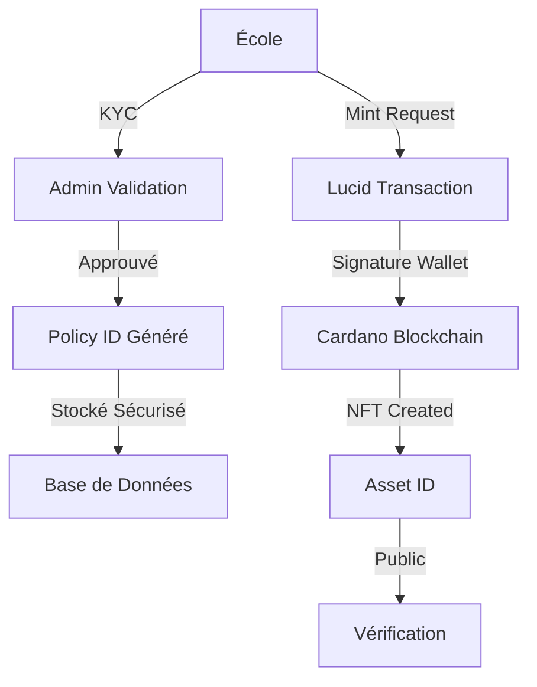
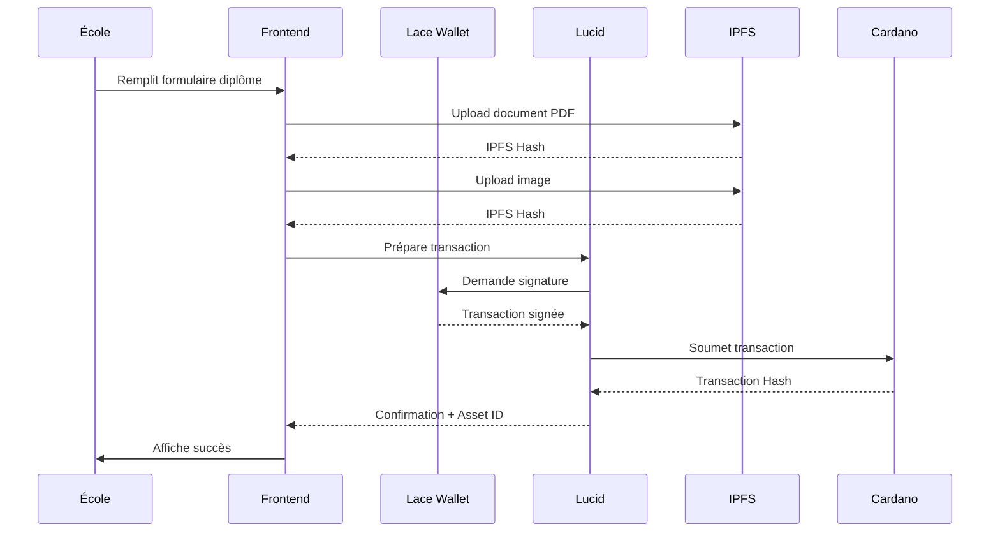
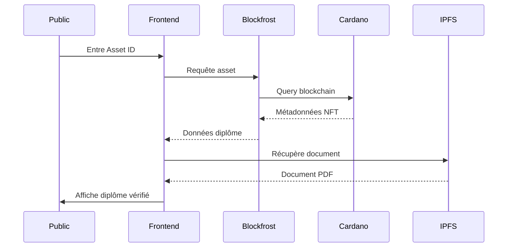

# PROOFCHAIN - Plateforme de Vérification Académique sur Cardano

## 📋 Vue d'Ensemble du Projet

PROOFCHAIN est une plateforme décentralisée de vérification académique construite sur la blockchain Cardano. Elle permet aux institutions éducatives d'émettre des diplômes sous forme de NFTs (Non-Fungible Tokens) et au public de vérifier l'authenticité de ces diplômes de manière transparente et immuable.

### Objectifs Principaux

1. **Authenticité Garantie**: Utiliser la blockchain Cardano pour créer des diplômes infalsifiables
2. **Vérification Publique**: Permettre à quiconque de vérifier un diplôme via un QR code ou un Asset ID
3. **Décentralisation**: Stocker les documents sur IPFS pour une disponibilité permanente
4. **Accessibilité**: Applications PWA multilingues (FR, EN, SW, LN) fonctionnant sur mobile et desktop

## 🏗️ Architecture Technique

### Structure du Monorepo

```
proofchain/
├── apps/
│   ├── verifier/          # Application publique de vérification (PWA)
│   ├── issuer/            # Application pour les écoles (PWA)
│   └── admin/             # Application super admin (PWA)
├── packages/
│   ├── ui/                # Composants UI partagés
│   └── chain/             # Utilitaires blockchain (Lucid, Blockfrost)
├── api/
│   └── hono-api/          # API backend (Hono.js sur Cloudflare Workers)
├── package.json           # Configuration workspace NPM
├── turbo.json             # Configuration Turborepo
└── .env.example           # Template des variables d'environnement
```

### Stack Technologique

#### Frontend
- **Framework**: Next.js 14+ avec App Router
- **Styling**: Tailwind CSS
- **Icons**: Lucide React
- **PWA**: Manifest.json + Service Workers
- **State Management**: React Hooks

#### Blockchain
- **Réseau**: Cardano Preprod (Testnet)
- **API Blockchain**: Blockfrost pour les requêtes on-chain
- **Transactions**: Lucid-Cardano pour la construction et signature des transactions
- **Wallet**: Lace Wallet (support natif Cardano)
- **Standard NFT**: CIP-25 (Cardano NFT Metadata Standard)

#### Stockage
- **IPFS**: NFT.Storage pour le stockage décentralisé des documents
- **Metadata**: On-chain via CIP-25

#### Backend
- **Framework**: Hono.js (optimisé pour Cloudflare Workers)
- **Database**: Cloudflare D1 (SQLite) ou PostgreSQL
- **Déploiement**: Cloudflare Workers

## 🔐 Modèle de Sécurité

### Gestion des Clés

1. **Policy IDs**: Chaque institution possède un Policy ID unique généré lors de l'inscription
2. **Clés Privées**: Stockées de manière sécurisée, jamais exposées dans le frontend
3. **Variables d'Environnement**: Toutes les clés API et secrets dans `.env`
4. **Wallet Connection**: Utilisation de Lace Wallet pour la signature des transactions

### Flux de Sécurité



### Mesures de Protection

- **KYC Obligatoire**: Toutes les écoles doivent passer par une validation admin
- **Audit Trail**: Toutes les transactions enregistrées on-chain
- **IPFS Pinning**: Documents permanents et immuables
- **Rate Limiting**: Protection contre les abus via l'API
- **CORS**: Configuration stricte pour les requêtes cross-origin

## 📱 Applications

### 1. Verifier (Application Publique)

**Port**: 3000  
**URL**: http://localhost:3000

#### Fonctionnalités

- **Page d'Accueil**: 
  - Barre de recherche pour Asset ID
  - Statistiques globales (diplômes vérifiés, institutions, etc.)
  - Liste des vérifications récentes
  
- **Scanner QR**: 
  - Accès caméra pour scanner les QR codes
  - Redirection automatique vers la page de vérification
  
- **Page de Vérification** (`/verify/[assetId]`):
  - Requête réelle à Blockfrost API
  - Affichage des métadonnées du diplôme
  - Statut de vérification (valide/invalide)
  - Lien vers le document IPFS
  - Lien vers Cardano Explorer
  
- **Paramètres**:
  - Sélecteur de langue (FR, EN, SW, LN)
  - Toggle thème clair/sombre

#### Technologies Clés

```typescript
// Vérification réelle via Blockfrost
import { verifyNFT } from '@proofchain/chain';

const result = await verifyNFT(assetId);
// result.valid: boolean
// result.metadata: DiplomaMetadata
// result.txHash: string
```

### 2. Issuer (Application École)

**Port**: 3001  
**URL**: http://localhost:3001

#### Fonctionnalités

- **Dashboard**:
  - Statistiques de l'école (diplômes émis, en attente, etc.)
  - Graphiques d'activité
  - Statut d'abonnement
  
- **Page de Minting** (`/mint`):
  - Formulaire complet pour les données du diplôme
  - Upload de document PDF vers IPFS
  - Upload d'image du diplôme vers IPFS
  - Prévisualisation avant minting
  - **Minting réel** avec Lucid sur Cardano Preprod
  - Affichage du Transaction Hash et Asset ID
  
- **Gestion Étudiants** (`/students`):
  - Import CSV/XLS pour batch minting
  - Ajout manuel d'étudiants
  - Liste et filtrage
  
- **Liste NFTs** (`/nfts`):
  - Consultation de tous les diplômes émis
  - Filtrage par date, étudiant, diplôme
  - Export en CSV
  
- **KYC** (`/kyc`):
  - Formulaire de vérification de l'école
  - Upload de documents légaux
  - Soumission à l'admin
  
- **Abonnement** (`/subscription`):
  - Gestion des crédits de minting
  - Historique de paiement
  - Upgrade de plan

#### Implémentation Minting (RÉELLE)

```typescript
// packages/chain/src/mint.ts
export async function mintDiplomaNFT(
  walletApi: any,
  params: MintingParams
): Promise<MintingResult> {
  // 1. Initialiser Lucid avec le wallet
  const lucid = await initLucidWithWallet(walletApi);
  
  // 2. Créer ou utiliser le policy existant
  const { policyId, policy } = await createMintingPolicy(lucid);
  
  // 3. Construire la transaction
  const tx = await lucid
    .newTx()
    .mintAssets({ [assetId]: BigInt(1) })
    .payToAddress(recipientAddress, { [assetId]: BigInt(1) })
    .attachMintingPolicy(policy)
    .attachMetadata(721, metadata) // CIP-25
    .complete();
  
  // 4. Signer et soumettre
  const signedTx = await tx.sign().complete();
  const txHash = await signedTx.submit();
  
  // 5. Attendre confirmation
  await lucid.awaitTx(txHash);
  
  return { success: true, txHash, assetId, policyId };
}
```

### 3. Admin (Application Super Admin)

**Port**: 3002  
**URL**: http://localhost:3002

#### Fonctionnalités

- **Dashboard Global**:
  - Vue d'ensemble de la plateforme
  - Statistiques toutes écoles confondues
  - Activité récente
  
- **Validation Écoles** (`/validation`):
  - Tableau des écoles en attente
  - Boutons Approuver/Refuser
  - Vérification des documents KYC
  
- **Gestion des Frais** (`/fees`):
  - Configuration des coûts de minting par école
  - Gestion des plans d'abonnement
  
- **Liste Écoles** (`/schools`):
  - Toutes les écoles actives
  - Filtrage et recherche
  - Statistiques individuelles
  
- **Détails École** (`/schools/[id]`):
  - Historique complet
  - Diplômes émis
  - Transactions blockchain

## 🔗 Intégration Blockchain

### Flux de Minting



### Flux de Vérification



## 🌐 API Backend (Hono.js)

### Endpoints

```typescript
// KYC
POST   /api/kyc                    // Soumettre KYC école
GET    /api/kyc/:schoolId          // Statut KYC

// Écoles
GET    /api/schools                // Liste toutes les écoles
GET    /api/schools/:id            // Détails école
PATCH  /api/schools/:id/status     // Approuver/Refuser
POST   /api/schools                // Créer école

// Statistiques
GET    /api/stats                  // Stats globales
GET    /api/stats/:schoolId        // Stats école

// Abonnement
GET    /api/subscription/:schoolId // Statut abonnement
POST   /api/subscription/payment   // Traiter paiement

// Frais
GET    /api/fees                   // Structure des frais
POST   /api/fees                   // Mettre à jour frais
```

### Base de Données (Cloudflare D1)

```sql
-- Écoles
CREATE TABLE schools (
  id TEXT PRIMARY KEY,
  name TEXT NOT NULL,
  policy_id TEXT UNIQUE,
  kyc_status TEXT DEFAULT 'pending',
  created_at DATETIME DEFAULT CURRENT_TIMESTAMP
);

-- KYC
CREATE TABLE kyc_submissions (
  id TEXT PRIMARY KEY,
  school_id TEXT REFERENCES schools(id),
  documents JSON,
  status TEXT DEFAULT 'pending',
  submitted_at DATETIME DEFAULT CURRENT_TIMESTAMP
);

-- Abonnements
CREATE TABLE subscriptions (
  id TEXT PRIMARY KEY,
  school_id TEXT REFERENCES schools(id),
  plan TEXT,
  credits_remaining INTEGER,
  expires_at DATETIME
);

-- Transactions
CREATE TABLE transactions (
  id TEXT PRIMARY KEY,
  school_id TEXT REFERENCES schools(id),
  tx_hash TEXT UNIQUE,
  asset_id TEXT,
  student_id TEXT,
  created_at DATETIME DEFAULT CURRENT_TIMESTAMP
);
```

## 🌍 Internationalisation

### Langues Supportées

- **Français (FR)**: Langue principale
- **English (EN)**: International
- **Kiswahili (SW)**: Afrique de l'Est
- **Lingala (LN)**: RDC/Congo

### Implémentation

```typescript
// packages/ui/src/hooks/useI18n.ts
const translations = {
  'wallet.connect': {
    fr: 'Connecter le portefeuille',
    en: 'Connect Wallet',
    sw: 'Unganisha Pochi',
    ln: 'Kokangisa Portefeuille',
  },
  // ...
};

// Utilisation
const { t, language, setLanguage } = useI18n();
<button>{t('wallet.connect')}</button>
```

## 🎨 Design System

### Couleurs

```css
/* Primary (Purple) */
--primary-50: #f5f3ff;
--primary-600: #7c3aed;
--primary-900: #4c1d95;

/* Gradients */
.gradient-primary {
  background: linear-gradient(to right, #7c3aed, #3b82f6);
}
```

### Composants UI Partagés

- **ConnectWalletButton**: Connexion Lace Wallet
- **InstitutionCard**: Affichage diplôme
- **Sidebar**: Navigation latérale
- **LanguageSelector**: Sélecteur de langue
- **ThemeToggle**: Toggle thème

## 📦 Installation et Déploiement

### Prérequis

```bash
# Node.js 18+
node --version

# NPM 9+
npm --version

# Lace Wallet installé
# https://lace.io
```

### Installation

```bash
# Cloner le repo
git clone <repo-url>
cd proofchain

# Installer les dépendances
npm install

# Copier .env.example
cp .env.example .env

# Configurer les variables d'environnement
# NEXT_PUBLIC_BLOCKFROST_PROJECT_ID=preprod_xxxxx
# NFT_STORAGE_API_KEY=xxxxx
```

### Développement

```bash
# Démarrer tous les apps
npm run dev

# Ou individuellement
npm run verifier:dev  # Port 3000
npm run issuer:dev    # Port 3001
npm run admin:dev     # Port 3002
npm run api:dev       # Port 8787
```

### Build Production

```bash
# Build tous les packages
npm run build

# Build individuel
npm run build --workspace=apps/verifier
```

### Déploiement

#### Vercel (Frontend)

```bash
# Verifier
cd apps/verifier
vercel --prod

# Issuer
cd apps/issuer
vercel --prod

# Admin
cd apps/admin
vercel --prod
```

#### Cloudflare Workers (API)

```bash
cd api/hono-api
wrangler publish
```

## 🧪 Tests et Vérification

### Test de Connexion Wallet

1. Ouvrir http://localhost:3001 (Issuer)
2. Cliquer "Connect Wallet"
3. Approuver dans Lace
4. Vérifier affichage de l'adresse et du solde

### Test de Minting

1. Connecter le wallet
2. Remplir le formulaire de diplôme
3. Upload document PDF et image
4. Cliquer "Mint Diploma NFT"
5. Signer la transaction dans Lace
6. Vérifier le Transaction Hash retourné
7. Consulter sur https://preprod.cardanoscan.io

### Test de Vérification

1. Copier l'Asset ID du diplôme minté
2. Ouvrir http://localhost:3000 (Verifier)
3. Entrer l'Asset ID
4. Vérifier l'affichage des métadonnées
5. Télécharger le document IPFS

## 🔧 Variables d'Environnement

### Blockfrost

```env
NEXT_PUBLIC_BLOCKFROST_PROJECT_ID=preprod_xxxxxxxxxxxxx
NEXT_PUBLIC_BLOCKFROST_NETWORK=preprod
```

**Obtenir**: https://blockfrost.io → Créer projet Preprod

### NFT.Storage

```env
NFT_STORAGE_API_KEY=eyJhbGciOiJIUzI1NiIsInR5cCI6IkpXVCJ9.xxxxx
```

**Obtenir**: https://nft.storage → Sign up → API Keys

### Hono API

```env
NEXT_PUBLIC_API_URL=http://localhost:8787
DATABASE_URL=<cloudflare-d1-url>
JWT_SECRET=your-secret-key
```

## 📊 Métriques et Monitoring

### Blockchain

- **Transactions**: Suivies via Cardano Explorer
- **Gas Fees**: Calculées automatiquement par Lucid
- **Confirmations**: Attendues via `lucid.awaitTx()`

### Application

- **Uptime**: Monitoring Vercel/Cloudflare
- **API Calls**: Blockfrost dashboard
- **IPFS Storage**: NFT.Storage dashboard
- **Errors**: Console logs + Sentry (optionnel)

## 🚀 Roadmap

### Phase 1 (Actuelle)
- ✅ Architecture monorepo
- ✅ Packages partagés (UI, Chain)
- ✅ Application Verifier
- ✅ Application Issuer avec minting réel
- ✅ Intégration Blockfrost et IPFS

### Phase 2 (À venir)
- [ ] Application Admin complète
- [ ] API Hono.js déployée
- [ ] Batch minting
- [ ] QR Code generation
- [ ] PWA offline support

### Phase 3 (Futur)
- [ ] Mainnet deployment
- [ ] Mobile apps natives (React Native)
- [ ] Analytics dashboard
- [ ] Multi-signature support
- [ ] Integration avec d'autres wallets

## 📄 Licence

Propriétaire - PROOFCHAIN © 2024

## 👥 Support

Pour toute question technique:
- Documentation: Ce fichier
- Issues: GitHub Issues
- Email: support@proofchain.io

---

**Note Importante**: Cette plateforme utilise des transactions blockchain RÉELLES sur le testnet Cardano Preprod. Assurez-vous d'avoir des ADA de test avant de commencer le minting.
